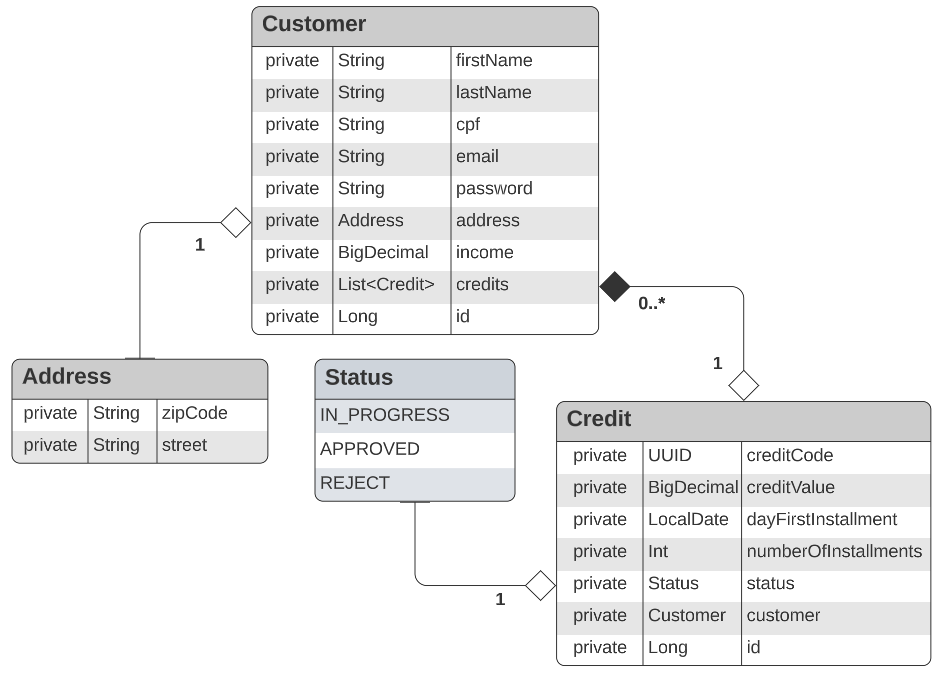

# API Rest para um Sistema de Analise de Solicitação de Crédito

## Pré-requisitos Para Rodar o Projeto:
> - Gradle
> - Java Versão 17
> - Spring boot Versão 3.0.7
> - Kotlin 1.7.22

## Opcionais:
> - IntelliJ IDEA
> - Postman
> - Flyway Migration
> - H2

> Essa API permite que os clientes da empresa realizem o cadastro, edição, visualização e exclusão de seus perfis.
> Além disso, eles podem cadastrar solicitações de empréstimo, listar todas as solicitações feitas e visualizar
> informações detalhadas sobre um empréstimo específico.
> 
> A API está coberta por testes unitários para garantir a qualidade e a estabilidade do código. 
> A maioria das classes já possui testes implementados, mas ainda faltam algumas classes para serem finalizadas. 
> Estou trabalhando para completar a cobertura de testes.

#### Diagrama UML Simplificado da API para Sistema de Avaliação de Crédito

## API desenvolvida usando Spring Boot e Kotlin para fornecer aos clientes as seguintes funcionalidades:

# Cliente (Customer):

## Cadastrar:

    Requisição: firstName, lastName, cpf, income, email, password, zipCode e street
    Resposta: String

## Editar cadastro:

    Requisição: id, firstName, lastName, income, zipCode, street
    Resposta: firstName, lastName, income, cpf, email, income, zipCode, street

## Visualizar perfil:

    Requisição: id
    Resposta: firstName, lastName, income, cpf, email, income, zipCode, street

## Deletar cadastro:

    Requisição: id
    Resposta: sem retorno

# Solicitação de Empréstimo (Credit):

## Cadastrar:

    Requisição: creditValue, dayFirstOfInstallment, numberOfInstallments e customerId
    Resposta: String

## Listar todas as solicitações de empréstimo de um cliente:

    Requisição: customerId
    Resposta: creditCode, creditValue, numberOfInstallment

## Visualizar um empréstimo:

    Requisição: customerId e creditCode
    Resposta: creditCode, creditValue, numberOfInstallment, status, emailCustomer e incomeCustomer
> Essas são apenas as descrições das requisições já implementadas.
> Há outras funcionalidades que podem ser adicionadas à API, dependendo dos requisitos e necessidades do negócio.

